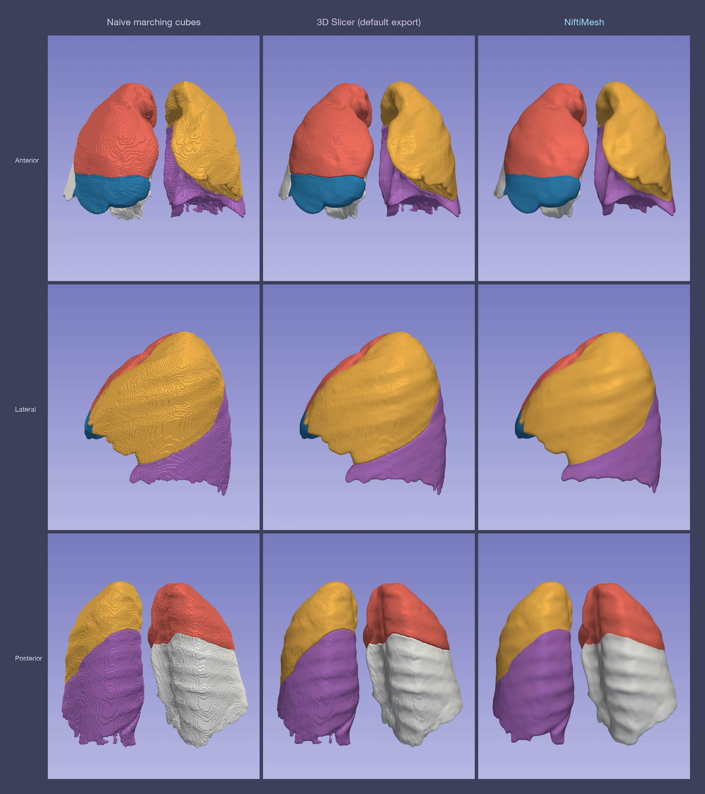
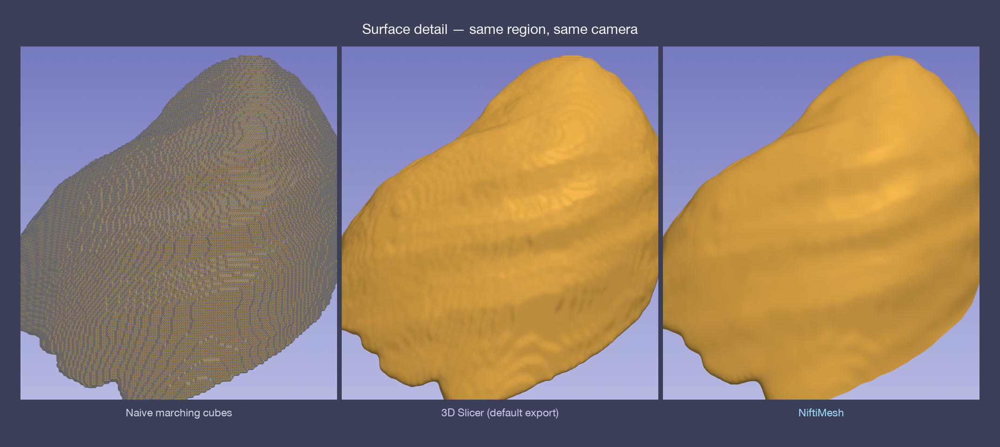

<div align="center">

# NiftiMesh

**Watertight, smooth STL reconstruction from NIfTI segmentations.**

[](https://pypi.org/project/niftimesh/)
[](https://pypi.org/project/niftimesh/)
[](LICENSE)
[](https://github.com/77even/NiftiMesh/actions/workflows/ci.yml)

Turn a multi-label `.nii.gz` segmentation into one clean, closed STL surface per label —
**solid, watertight, manifold, self-intersection-free**, with adjacent regions sharing
their interface seam *bit-identically* so they assemble seamlessly in Slicer / Mimics.

</div>

---

## Why

The generic "voxel → STL" that most tools ship is a per-label marching cubes: it
leaves a **blocky voxel staircase**, faceted surfaces, and — when one structure is
split into touching regions (lung lobes, liver segments) — **cracked or overlapping
seams** at the boundaries. NiftiMesh fixes all of it.



> One lung-lobe segmentation, three pipelines, identical cameras. Left: naive marching
> cubes (raw voxel staircase). Middle: a typical 3D Slicer default export (per-segment
> smoothing — smoother, but every lobe is built independently). Right: **NiftiMesh** —
> watertight, smooth, and the lobes share each fissure seam so they read as one organ.



> Same lobe, same camera. The voxel staircase (left) → Slicer's residual ripples
> (middle) → NiftiMesh's fissure-accurate smoothing (right).

*(Both figures are generated from the bundled sample with
[`assets/render_comparison.py`](assets/render_comparison.py) — see [Reproduce the figures](#reproduce-the-figures).)*

---

## Two reconstruction modes

| Mode | What it does | Use for |
|------|--------------|---------|
| **`csg`** | Boolean-CSG peel: splits **one** connected hull into per-label solids with half-space cutters. Neighbouring labels share their cut seam vertex-for-vertex — no crack, no black line. | One structure partitioned by internal interfaces: **lung lobes / segments, Couinaud liver segments**. |
| **`independent`** | Each label is built as its **own** closed, smoothed, watertight surface (no shared cut). | **Disjoint multi-organ** scenes: liver + spleen + kidneys + …, vessels. |

Both produce solid, watertight (boundary edges = 0), manifold, self-intersection-free
meshes. A light Gaussian on the label field (physical-mm isotropic) plus WindowedSinc
fairing gives the smooth, de-staircased finish.

---

## Install

```bash
pip install niftimesh          # core: independent + naive modes
pip install "niftimesh[csg]"   # + meshlib, enables the boolean-CSG mode
pip install "niftimesh[all]"   # + SimpleITK, pyvista (viz), everything
```

Requires Python ≥ 3.9. The `csg` mode needs [`meshlib`](https://pypi.org/project/meshlib/)
(CPU-only). NIfTI is read via `nibabel` (bundled) or `SimpleITK` if installed.

---

## Quick start

### Command line

```bash
# Lung lobes (CSG peel) — preset supplies label names + the recommended mode
niftimesh lobe_seg.nii.gz out/ --preset lung_lobe --suffix _3d

# Disjoint organs — independent surfaces
niftimesh organs.nii.gz out/ --mode independent

# Custom label names from JSON ({"1": "tumor", "2": "vessel"})
niftimesh seg.nii.gz out/ --label-names names.json

# The naive baseline (plain marching cubes), e.g. for comparison
niftimesh seg.nii.gz out_raw/ --mode naive
```

Output files are named by their label (`right_upper_lobe_3d.stl`, `label_3.stl`, …),
so naming is **entirely up to you** via `--preset`, `--label-names`, or `--suffix` —
nothing is hard-coded to lungs.

### Python API

```python
from niftimesh import nifti_to_stl

# High-level: file in, per-label STLs out
nifti_to_stl("lobe_seg.nii.gz", "out/", preset="lung_lobe")
nifti_to_stl("organs.nii.gz", "out/", mode="independent",
             label_names={1: "liver", 2: "spleen", 3: "left_kidney"})

# In-memory: numpy label volume -> {label: vtkPolyData}
import numpy as np
from niftimesh import reconstruct
meshes = reconstruct(seg_zyx, spacing=(0.84, 0.84, 1.0), mode="csg")
```

---

## Presets

Built-in label maps + the recommended mode (`niftimesh.PRESETS`):

| Preset | Mode | Labels |
|--------|------|--------|
| `lung_lobe` | csg | 5 pulmonary lobes |
| `lung_segment` | csg | 18 bronchopulmonary segments |
| `couinaud` | csg | 8 Couinaud liver segments |
| `core_organs` | independent | liver, pancreas, spleen, kidneys |
| `vessel` | independent | portal / hepatic vein, hepatic artery |

Pass your own with `label_names=` / `--label-names` to override or extend.

---

## How it works (CSG mode)

```
remaining = closed hull            (union of all labels, gaussian σ, iso 0.5, WindowedSinc)
for L in labels[:-1]:
    cutter_L  = MC( field_L − max(field of the rest) = 0 )      # a closed half-space solid
    out[L]    = Intersection(remaining, cutter_L)               # the peeled region
    remaining = DifferenceAB(remaining, cutter_L)               # everything left
out[labels[-1]] = remaining
```

`Intersection` and `DifferenceAB` of the **same** `(remaining, cutter_L)` pair come from
one deterministic meshlib corefinement, so the two sides share the cut surface
vertex-for-vertex — that is what makes the seam seamless. Disconnected foreground
components (e.g. left/right lungs across the mediastinal gap) are peeled separately so a
boolean never eats an untouched blob. Meshes are built in physical-mm space; the caller
applies the `world = origin + spacing · ijk` transform. ~3.6 s for 5 lobes / ~8.6 s for
18 segments on 10 cores.

---

## Reproduce the figures

```bash
pip install "niftimesh[all]"
python assets/render_comparison.py \
    --input examples/data/lung_lobe_seg.nii.gz \
    --outdir assets --preset lung_lobe
```

Renders the naive / Slicer-style / NiftiMesh comparison and the surface close-up from the
bundled sample. Works for any segmentation — point `--input` / `--preset` at your own.

---

## Acknowledgements

The CSG reconstruction is built on [VTK](https://vtk.org/),
[meshlib](https://github.com/MeshInspector/MeshLib), and
[SciPy](https://scipy.org/). The 3D Slicer comparison column emulates the default
segmentation → closed-surface export of [3D Slicer](https://www.slicer.org/).

## License

[MIT](LICENSE) © 2026 Justin
